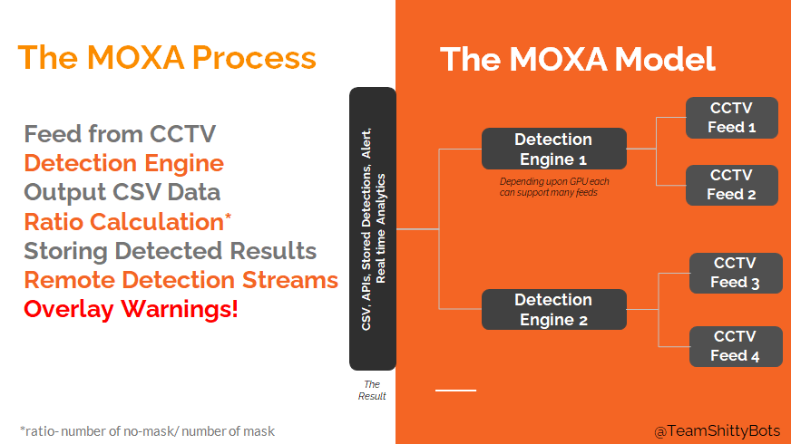

# **MOXA** - A Deep Learning Based Approach to detect face masks from CCTV feeds


## Why do we need MOXA?
#### Why do we need mask detection?
> With 6.31M confirmed cases under the attack of COVID-19 in India. Maintaining sanity and hygiene remains the only way to prevent and fight the spreading of this deadly virus and making every individual aware of their sanitary health and ongoing COVID-19 epidemic.
#### Then, Why MOXA?
>Wearing masks is a necessity as per medical practitioners whenever you are at public places or places with high probability of people gathering, to reduce transmission rates. Manual monitoring would require a huge manpower engagement to overcome these we propose a real-monitoring of people wearing medical masks and determing the regions with high transmission chances.


##  Why is MOXA unique?

- ### **Custom Dataset**
  - The model is trained on a custom dataset of 10000 images (with over 90000 labels)
- ### **Multiple Video-Streams**
  - Streams videos after being run through detection model of different locations.
- ### **Mask to No-mask plot**
  - Camera ID based line graph of number of people wearing masks to number of people not wearing masks on the basis of periodic frame counts. 
- ### **Ratio to time plot**
  - Camera ID based line graph of ratio (of nomasks to masks) to time. 
- ### **Exportable Analytics**
  - The analytics provided about the detection can be exported as .avi files.

## A Look Into How MOXA Works



## What it Does

1. **CCTV feed** - The model is provided with CCTV video feeds for detection.
2. **Detection Procedure** - The model detects masks and no masks from the CCTV feeds.
3. **Ratio Calculation** - Calculates the ratio of number of no-mask to mask in each frame and a finally its average across a periodic frame count is used to store in a .csv file.
4. **Graphical Representation**- Two line graphs are plotted on the basis of the .csv files.
    - **mask to no-mask**
    - **ratio to time**
5. **Remote Detection Streams**- The CCTV feeds are streamed with detections.
6. **Overlay Warning**- The loactions with ratio lower than threshold value are marked with higher transmission chances

## Technology Stack and Dependencies
- **Operating System**
  - Linux (with xterm)
- **Deep Learning**
  - Darknet Framework
  - CUDA 10.1
  - CUDNN 7
  - OpenCV(with CUDA support)
- **APIs**
  - Python Script
- **Front-end**
  - PyQt5

## How to run MOXA
```
git clone https://github.com/Hack-n-Chill/ShittyBots.git
cd ShittyBots
chmod +x moxa.sh
./moxa.sh
```
### Dataset Enrichment

With time to increase the accuracy of the model we wish to enrich our dataset further more.

### Unsupervised Learning

We wish to incoporate unsupervised learning to reduce periodic updates of the model for upgrading its functioning precision.

### Multiple Object Tracking

We wish to develop an algorithm to identify a person occuring in multiple frames as one to overcome the redundancy in the ratio calculation and its plot.

###

# Thank You!

<h1 align="center"> Contributors </h1>
<table align="center">
<tr align="center">
<td>
<strong>Biparnak Roy</strong>
<p align="center">

</p>
<p align="center">
<a href = "https://github.com/biparnakroy"></a>
<a href = "https://www.linkedin.com/in/biparnak-roy-b32b34a8">

</a>
</p>
</td>
<td>
<strong>Debojit Ghosh</strong>
<p align="center">

</p>
<p align="center">
<a href = "https://github.com/drag-ged"></a>
<a href = "https://www.linkedin.com/in/debojit-ghosh-323657146">

</a>
</p>
</td>
<td>
<strong>Subhadip Nandy</strong>
<p align="center">

</p>
<p align="center">
<a href = "https://github.com/Subhadip-decode"></a>
<a href = "https://www.linkedin.com/in/subhadip-nandy-b07945188">

</a>
</p>
</td>
</tr>
</table>
